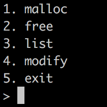
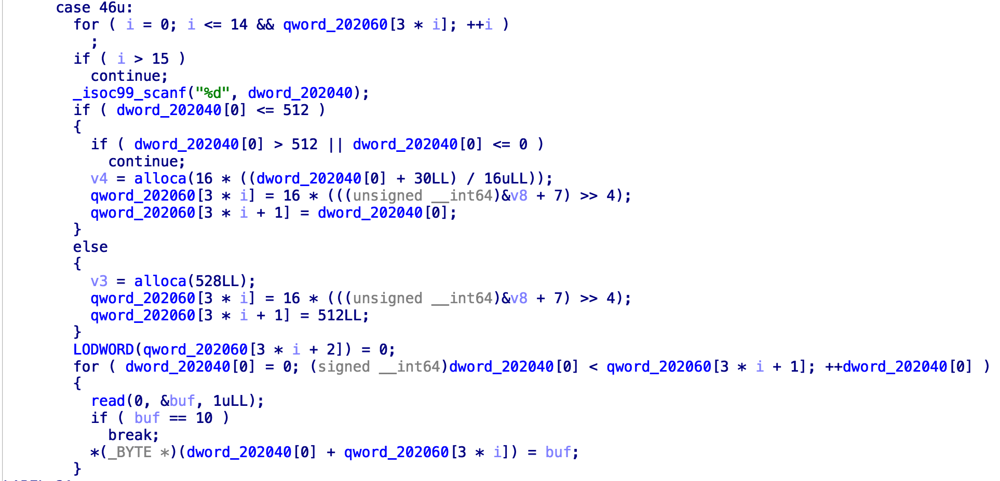
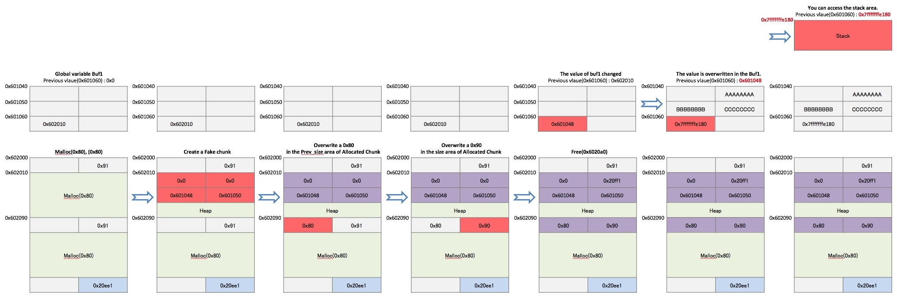

#combination

@kommadot

할당, 프리, 내용확인, 내용수정의 기능이 들어있는 프로그램이다.

ida로 열어봤을때 특별한건 없어보였지만 작은 취약점이 있지 않을까 하고 열심히 뒤져봤다.

찾은걸로는 큰사이즈를 할당한후 내용을 꽉채우고 프리하고 작은사이즈를 할당한 뒤 내용을 보면 fd 나 bk가 출력되긴 하는데 이런걸로 아무것도 할 수 없음을 깨닫고 접었습니다. 

~~결국 라이트업을 봤습니다. 취약점을 몰라서 봤어요~~

그래서 취약점이 modify에 있는 마지막 + 1바이트를 \x00 으로 바꿔주는게 poison null byte를 유발하는걸 깨달았습니다. 처음들어봐서 검색을 했고 이 취약점으로 청크의 prev_inuse 와 fd , bk를 조작해서 unsafe_unlink로 이어지는걸 알아냈습니다.

릭은 저 메뉴중 숨겨진 부분인 46번 항목이 존재하는데 

이 항목은 힙이 아닌 스택영역에 alloca 매크로를 통해서 공간을 만들어서 넘겨주는데 이 공간은 초기화가 되어있지 않아서 여러가지 데이터가 남아있습니다. 코드영역의 주소, 스택영역의 주소, libc영역의 주소들이 남아있어서 원하는 값을 골라서 릭을한뒤 오프셋을 계산해주면 된다.

unlink취약점은 

이런 방식으로 생긴다.

할당된 힙을 가리키는 주소가 전역변수로 선언이 되어있어서 릭을했을경우 그위치를 특정지을 수 있다. unlink취약점으로 free_hook에 원샷 가젯을 넣은뒤 free를 하면 원샷가젯이 실행되어서 익스가 성공한다.

